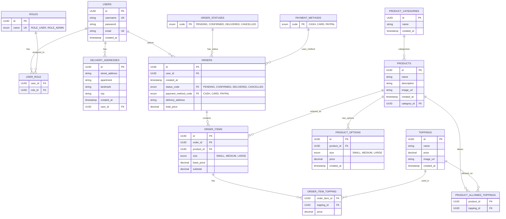

# 🍕 PTPT Pizza - Spring Boot Application

A modern, full-featured pizza ordering web application built with Spring Boot, featuring user authentication, shopping cart, order management, and admin capabilities.

## 🚀 Features

### 🔐 User Authentication & Authorization

- User registration and login system
- Role-based access control (USER, ADMIN)
- Session management with Spring Security
- Secure password encryption

### 🍕 Menu & Product Management

- Browse pizza menu with categories
- Product details with customizable sizes
- Topping selection and pricing
- Responsive product cards with images

### 🛒 Shopping Cart

- Interactive shopping cart with local storage
- Add/remove items with real-time updates
- Cart count badge in navigation
- Persistent cart across sessions

### 📦 Order Management

- Complete checkout process with delivery addresses
- Multiple payment methods (Cash, Card, PayPal)
- Order history for users
- Order status tracking (Pending, Confirmed, Delivered, Cancelled)
- Order details view with itemized breakdown

### 👨‍💼 Admin Features

- Admin dashboard for order management
- View all orders with filtering capabilities
- User management system
- Order status updates

### 🎨 Modern UI/UX

- Responsive Bootstrap design
- Mobile-friendly interface
- Toast notifications for user feedback
- Smooth animations and transitions
- Professional navbar with dropdowns

## 🛠️ Technology Stack

### Backend

- **Spring Boot 3.3.0** - Main framework
- **Spring Security** - Authentication & authorization
- **Spring Data JPA** - Database operations
- **Hibernate** - ORM framework
- **MySQL** - Database
- **Maven** - Dependency management

### Frontend

- **Thymeleaf** - Server-side templating
- **Bootstrap 5.1.0** - CSS framework
- **Font Awesome 6.5.0** - Icons
- **JavaScript ES6** - Client-side functionality
- **Local Storage API** - Cart persistence

### Additional Libraries

- **Lombok** - Reduce boilerplate code
- **SLF4J** - Logging framework
- **HikariCP** - Connection pooling

## 📊 Database Entity Relationship Diagram (ERD)



## 🗄️ Database Schema Details

### 🔑 **Primary Entities**

#### **USERS Table**

- **Purpose**: Store user account information
- **Key Fields**: id (UUID), username, email (both unique), password (encrypted)
- **Relationships**:
  - Many-to-Many with ROLES (via USER_ROLE junction table)
  - One-to-Many with DELIVERY_ADDRESSES
  - One-to-Many with ORDERS

#### **ORDERS Table**

- **Purpose**: Store customer orders
- **Key Fields**: id (UUID), total_price, delivery_address, created_at
- **Relationships**:
  - Many-to-One with USERS
  - Many-to-One with ORDER_STATUSES
  - Many-to-One with PAYMENT_METHODS
  - One-to-Many with ORDER_ITEMS

#### **PRODUCTS Table**

- **Purpose**: Store pizza menu items
- **Key Fields**: id (UUID), name, description, image_url
- **Relationships**:
  - Many-to-One with PRODUCT_CATEGORIES
  - One-to-Many with PRODUCT_OPTIONS
  - Many-to-Many with TOPPINGS (via PRODUCT_ALLOWED_TOPPINGS)
  - One-to-Many with ORDER_ITEMS

### 🔗 **Junction Tables**

#### **USER_ROLE**

- **Purpose**: Many-to-Many relationship between Users and Roles
- **Composite Key**: (user_id, role_id)

#### **PRODUCT_ALLOWED_TOPPINGS**

- **Purpose**: Many-to-Many relationship between Products and allowed Toppings
- **Composite Key**: (product_id, topping_id)

#### **ORDER_ITEM_TOPPING**

- **Purpose**: Many-to-Many relationship between Order Items and Toppings
- **Composite Key**: (order_item_id, topping_id)
- **Additional Field**: price (topping price at time of order)

### 📋 **Reference Tables**

#### **ORDER_STATUSES**

- **Values**: PENDING, CONFIRMED, DELIVERED, CANCELLED
- **Purpose**: Maintain order status consistency

#### **PAYMENT_METHODS**

- **Values**: CASH, CARD, PAYPAL
- **Purpose**: Define available payment options

#### **ROLES**

- **Values**: ROLE_USER, ROLE_ADMIN
- **Purpose**: Define user access levels

### 🎯 **Key Design Patterns**

1. **UUID Primary Keys**: All entities use UUID for better scalability and security
2. **Soft References**: Order items store snapshot data (price, size) for historical accuracy
3. **Enum Tables**: Separate tables for order statuses and payment methods for data integrity
4. **Junction Tables**: Proper many-to-many relationships with additional attributes where needed
5. **Timestamp Tracking**: CreationTimestamp for audit trails

### 📈 **Database Statistics**

- **Total Tables**: 12 main tables + 3 junction tables = 15 tables
- **Primary Entities**: 6 (Users, Orders, Products, Toppings, Categories, Addresses)
- **Reference Tables**: 3 (Roles, Order Statuses, Payment Methods)
- **Junction Tables**: 3 (User-Role, Product-Topping, Order Item-Topping)
- **Relationships**: 15+ foreign key relationships

This ERD represents a well-normalized database design that supports all the features of your pizza ordering application while maintaining data integrity and performance.

## 📁 Project Structure

```
src/
├── main/
│   ├── java/com/example/pizzaapp/
│   │   ├── config/              # Configuration classes
│   │   │   ├── OrderStatusDataLoader.java
│   │   │   ├── PaymentMethodDataLoader.java
│   │   │   └── SecurityConfig.java
│   │   ├── controllers/         # REST controllers
│   │   │   ├── AdminController.java
│   │   │   ├── AuthController.java
│   │   │   ├── CartController.java
│   │   │   ├── CheckoutController.java
│   │   │   ├── IndexController.java
│   │   │   ├── MenuController.java
│   │   │   └── OrderController.java
│   │   ├── dtos/               # Data transfer objects
│   │   │   ├── CartItemDto.java
│   │   │   ├── OrderDetailDto.java
│   │   │   ├── OrderItemDetailDto.java
│   │   │   ├── OrderSummaryDto.java
│   │   │   ├── OrderToppingDto.java
│   │   │   ├── ProductView.java
│   │   │   └── RegistrationDto.java
│   │   ├── enums/              # Enumerations
│   │   │   ├── PaymentMethodEnum.java
│   │   │   ├── ProductCategory.java
│   │   │   ├── ProductSize.java
│   │   │   └── RoleEnum.java
│   │   ├── models/             # Entity classes
│   │   │   ├── DeliveryAddress.java
│   │   │   ├── Order.java
│   │   │   ├── OrderItem.java
│   │   │   ├── OrderItemTopping.java
│   │   │   ├── OrderStatus.java
│   │   │   ├── PaymentMethod.java
│   │   │   ├── Product.java
│   │   │   ├── ProductOption.java
│   │   │   ├── Role.java
│   │   │   ├── Topping.java
│   │   │   └── User.java
│   │   ├── repositories/       # Data access layer
│   │   │   ├── OrderRepository.java
│   │   │   ├── OrderStatusRepository.java
│   │   │   ├── PaymentMethodRepository.java
│   │   │   ├── ProductRepository.java
│   │   │   ├── RoleRepository.java
│   │   │   ├── ToppingRepository.java
│   │   │   └── UserRepository.java
│   │   ├── services/           # Business logic
│   │   │   ├── AddressService.java
│   │   │   ├── CartService.java
│   │   │   ├── CustomUserDetailsService.java
│   │   │   ├── OrderService.java
│   │   │   ├── PaymentService.java
│   │   │   ├── PricingService.java
│   │   │   ├── ProductViewService.java
│   │   │   └── UserService.java
│   │   └── utils/              # Utility classes
│   │       └── UUIDv7Generator.java
│   └── resources/
│       ├── static/             # Static assets
│       │   ├── assets/         # Images and logos
│       │   ├── css/           # Stylesheets
│       │   └── js/            # JavaScript files
│       ├── templates/          # Thymeleaf templates
│       │   ├── admin/         # Admin pages
│       │   ├── layouts/       # Layout fragments
│       │   └── pages/         # Application pages
│       └── application.properties
└── test/                      # Test files
```

## ⚙️ Setup & Installation

### Prerequisites

- Java 23 or higher
- Maven 3.6+
- MySQL 8.0+
- IDE (IntelliJ IDEA recommended)

### 1. Clone the Repository

```bash
git clone https://github.com/Solange-s-Courses/ex4-spring-anas-amr.git
cd spring-pizza-app
```

### 2. Database Setup

```sql
CREATE DATABASE pizzashop;
```

### 3. Build and Run

```bash
# Build the project
mvn clean compile

# Run the application
mvn spring-boot:run
```

### 5. Access the Application

- **Application**: http://localhost:8080

## 🔑 Default Credentials

### Admin Account

- **Username**: admin
- **Email**: admin@pizza.com
- **Password**: admin123

## 📱 Application Screenshots

### Home Page

- Modern landing page with hero section
- Featured products and testimonials
- Responsive design for all devices

### Menu Page

- Grid layout of pizza products
- Filter by categories
- Add to cart functionality

### Shopping Cart

- View cart items with quantities
- Update/remove items
- Proceed to checkout

### Checkout Process

- Delivery address management
- Payment method selection
- Order summary and confirmation

### Order Management

- User order history
- Detailed order views
- Order status tracking

### Admin Dashboard

- Order management interface
- User administration
- Analytics and reporting

## 🗄️ Database Schema

### Key Entities

- **Users**: User accounts with roles
- **Products**: Pizza menu items
- **Orders**: Customer orders with items
- **Order Items**: Individual pizza orders with toppings
- **Delivery Addresses**: Customer shipping addresses
- **Payment Methods**: Available payment options

### Relationships

- Users → Orders (One-to-Many)
- Orders → Order Items (One-to-Many)
- Order Items → Toppings (Many-to-Many)
- Users → Delivery Addresses (One-to-Many)

## 🔒 Security Features

- **CSRF Protection**: Enabled for all state-changing operations
- **Password Encryption**: BCrypt hashing
- **Session Management**: Secure session handling
- **Role-based Authorization**: Method-level security
- **Input Validation**: Server-side validation for all forms

## 📝 API Endpoints

### Public Endpoints

- `GET /` - Home page
- `GET /menu` - Menu page
- `GET /cart` - Shopping cart
- `GET /login` - Login page
- `POST /register` - User registration

### Authenticated Endpoints

- `GET /checkout` - Checkout page
- `POST /checkout/submit` - Place order
- `GET /orders` - Order history
- `GET /orders/{id}` - Order details

### Admin Endpoints

- `GET /admin/orders` - All orders
- `GET /admin/users` - User management

## 📈 Future Enhancements

- [ ] Email notifications for orders
- [ ] Real-time order tracking
- [ ] Customer reviews and ratings
- [ ] Loyalty program
- [ ] Mobile app development
- [ ] Payment gateway integration
- [ ] Inventory management
- [ ] Analytics dashboard
- [ ] Multi-language support
- [ ] Delivery tracking system

## � Authors

<div align="center">

### 🚀 Development Team

</div>

<table>
<tr>
<td align="center" width="50%">

<br/>
<h3>� Anas Dweik</h3>
<p><strong>Full Stack Developer</strong></p>

[](https://github.com/Anas-Emad-Dweik)
[](mailto:aansdw@edu.jmc.ac.il)

**Student ID:** `322362013`

<details>
<summary>🛠️ <strong>Contributions</strong></summary>

- 🏗️ **Backend Architecture** - Spring Boot setup & configuration
- 🔐 **Security Implementation** - Authentication & authorization
- 📊 **Database Design** - Entity modeling & relationships
- 🛒 **Order Management** - Checkout flow & order processing
- 📱 **API Development** - RESTful endpoints & controllers

</details>
</td>

<td align="center" width="50%">

<br/>
<h3>🎨 Amr Shwiki</h3>
<p><strong>Full Stack Developer</strong></p>

[](https://github.com/Amr-Shwieky2)
[](mailto:amrsh@edu.jmc.ac.il)

**Student ID:** `212443485`

<details>
<summary>🛠️ <strong>Contributions</strong></summary>

- 🎨 **UI/UX Design** - Modern responsive interface design
- 🌐 **Frontend Development** - Thymeleaf templates & styling
- 📱 **JavaScript Features** - Cart functionality & interactions
- 🎯 **User Experience** - Navigation & user flow optimization
- 📋 **Testing & QA** - Frontend testing & bug fixes

</details>
</td>
</tr>
</table>

<div align="center">

---

### 🎓 Academic Project Information

**Institution:** Jerusalem College of Technology  
**Course:** Advanced Web Development  
**Project:** Spring Boot Pizza Ordering System  
**Year:** 2024-2025

[](https://spring.io/projects/spring-boot)
[](https://www.mysql.com/)
[](https://getbootstrap.com/)
[](https://www.thymeleaf.org/)

</div>

---

[](https://classroom.github.com/a/8QmaQ0gF)
